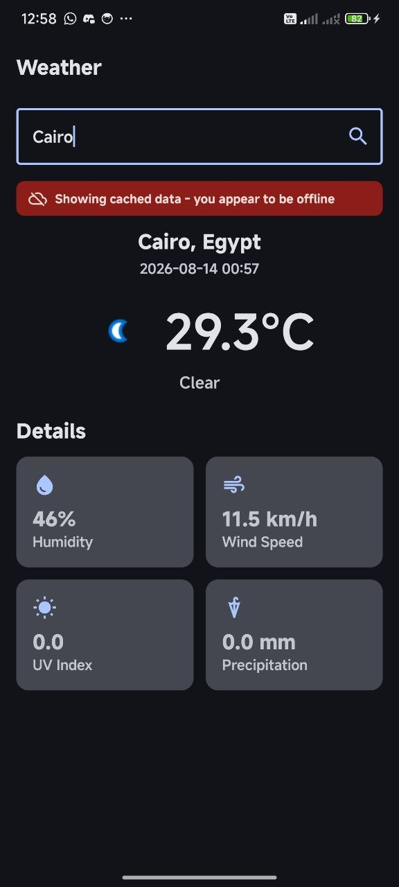
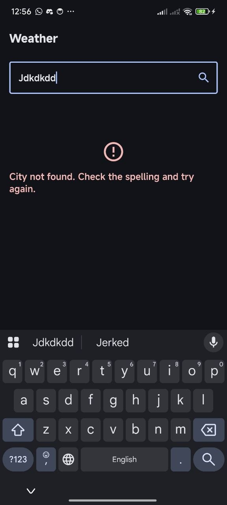
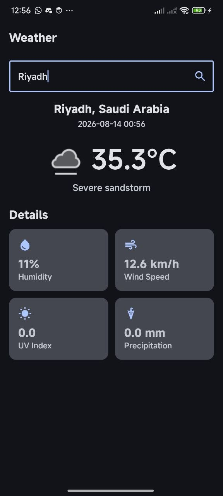
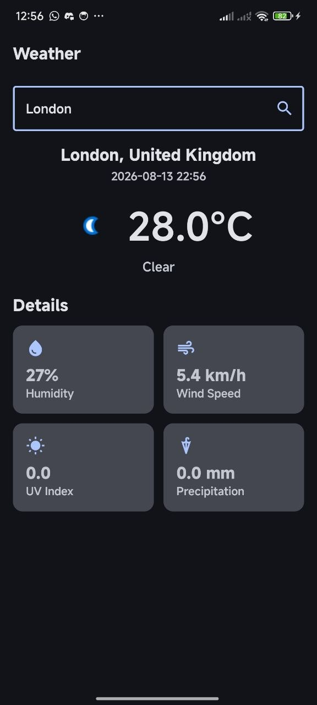

# Weather App — Android Developer Assessment

A native Android weather app built with Kotlin + Jetpack Compose. Search any
city and see the current temperature, condition, and detailed metrics
(humidity, wind, UV index, precipitation), pulled live from
[WeatherAPI.com](https://www.weatherapi.com/).

This was built for the Android Developer hiring assessment. I implemented
every item from the required stack plus all five bonus points (StateFlow/UDF,
Hilt DI, unit tests, Room offline caching, and UI polish).

## Screenshots / demo

**Live weather search** — Search any city and see real-time temperature, condition, humidity, wind speed, UV index, and precipitation:

| London | Cairo (Offline Cache) | Riyadh |
|--------|----------------------|--------|
|  |  |  |

**Online mode** (Cairo fetching live data):



**Error handling** — Graceful "city not found" message with spelling suggestions:



## Setup — how to run this

1. Clone the repo and open it in **Android Studio** (or IntelliJ IDEA with the
   Android plugin installed — File → Settings → Plugins → search "Android").
2. Get a **free API key** from https://www.weatherapi.com/ (sign up, the key
   is on your dashboard immediately, no credit card needed).
3. Open `gradle.properties` at the project root and paste your key in:
   ```properties
   WEATHER_API_KEY=your_real_key_here
   ```
   The key is read into `BuildConfig.WEATHER_API_KEY` at build time (see
   `app/build.gradle.kts`) so it's never hardcoded in source. `gradle.properties`
   is still tracked in this repo for convenience of grading — in a real
   project I'd gitignore it and use `local.properties` instead.
4. Let Gradle sync (Android Studio will prompt you). First sync downloads
   Compose BOM 2024.06.00, Hilt, Room, Retrofit, etc. — takes a minute or two.
5. Run on an emulator or physical device (minSdk 26 / Android 8.0+).

If you just want the APK, there's a debug build in the repo root /
GitHub Releases — install it and it'll ask for the API key the same way
(it's baked into the debug build I generated, but you can rebuild with your
own key using the steps above).

## Architecture

**MVVM**, with a repository layer between the ViewModel and data sources:

```
UI (Compose)  →  WeatherViewModel  →  WeatherRepository  →  Retrofit (network)
                       ↑                      ↓
                  StateFlow<UiState>     Room (cache)
```

- **`data/remote`** — `WeatherApiService`, the Retrofit interface, plus
  `WeatherResponse` which mirrors the raw WeatherAPI.com JSON.
- **`data/local`** — Room `WeatherEntity` + `WeatherDao` + `WeatherDatabase`.
  I only cache the *last successfully searched city* (single row, id=0,
  `REPLACE` conflict strategy) — that's all the task asked for.
- **`data/model`** — `WeatherModel` is the clean domain model the UI actually
  consumes, decoupled from the raw API response shape. `WeatherUiState` is
  the sealed interface for screen state (`Idle | Loading | Success | Error`).
- **`data/repository`** — `WeatherRepository` is the single source of truth.
  It tries the network first; on failure (no internet, bad city, server
  error) it falls back to whatever's cached in Room before giving up and
  showing an error.
- **`viewmodel`** — `WeatherViewModel` exposes `StateFlow<WeatherUiState>`
  and follows unidirectional data flow: the UI sends events in
  (`onSearchQueryChanged`, `onSearchTriggered`), the ViewModel is the only
  thing that mutates state, and the UI just renders whatever it publishes.
- **`ui`** — Compose screens/components, Material3, `Scaffold`,
  edge-to-edge, dark/light + dynamic color theming.
- **`di`** — Hilt modules (`NetworkModule`, `DatabaseModule`,
  `RepositoryModule`) wiring Retrofit/OkHttp, Room, and the repository as
  singletons.

## Libraries used (and why)

| Library | Why |
|---|---|
| Jetpack Compose + Material3 | required, and honestly faster to iterate on than XML for a screen like this |
| Retrofit + Gson | standard, well-documented REST client; Gson is fine for a JSON shape this simple |
| Coroutines + `viewModelScope` | non-blocking network calls without callback soup |
| Coil | image loading for the weather condition icon; lighter than Glide for Compose |
| **Hilt** (bonus) | constructor injection for ViewModel/Repository/Retrofit/Room instead of manual factories |
| **Room** (bonus) | offline cache of the last search so the app isn't blank with no internet |
| **StateFlow** (bonus) | UDF instead of LiveData, works naturally with `collectAsStateWithLifecycle()` |
| **MockK + coroutines-test + Turbine** (bonus) | unit tests for the ViewModel without hitting the real network |

## What I'd do with more time

- Add a search history / list of favorite cities (would need a proper Room
  table instead of the single-row cache).
- Handle location permissions to auto-detect the user's current city.
- Add instrumented UI tests (Compose testing APIs), not just ViewModel unit
  tests.
- Swap Gson for kotlinx.serialization or Moshi — Gson works fine here but
  isn't the modern default anymore.
- Localize temperature units (°C/°F toggle) — WeatherAPI supports both.

## Notes on API errors

- **400** → city not found (bad spelling shows a friendly message, not a
  stack trace).
- **401/403** → invalid/missing API key — points you back at
  `gradle.properties`.
- **No internet** → falls back silently to the last cached search if one
  exists, with a small "showing cached data" banner; otherwise shows an
  error.

## Running the tests

```bash
./gradlew testDebugUnitTest
```

Tests live in `app/src/test/java/com/student/weatherapp/` — `WeatherViewModelTest`
covers loading/success/error/offline-fallback state transitions, and
`WeatherMapperTest` covers the API-response-to-domain-model mapping.
